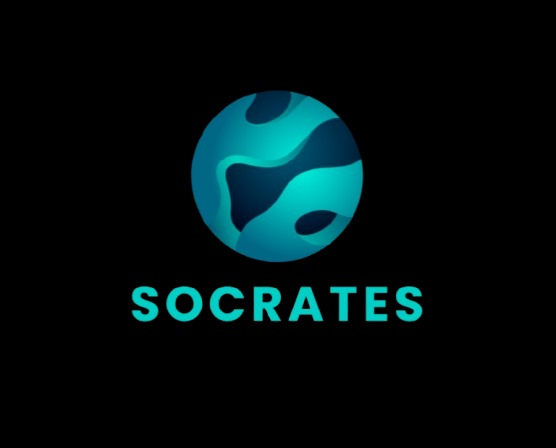

# Socrates: AI-Assisted Onboarding & Corporate Training Platform



> **Project by Team Enigmatrix for improving Learning Experience at Salesforce**

## Overview

Socrates is a cutting-edge AI-assisted onboarding and corporate training solution that revolutionizes the learning experience by focusing on customer-centric education. Unlike traditional learning management systems, Socrates employs advanced artificial intelligence to create personalized, adaptive learning experiences that evolve with each user.

Our platform serves as a flexible alternative to Salesforce Trailhead, but with a domain-agnostic architecture capable of serving learners across various fields, from enterprise software to creative skills.

## Core Philosophy

Socrates separates **how to teach** from **what to teach**:
- The AI foundation excels in instructional design, breaking down complex topics, generating analogies, and creating interactive learning experiences
- Subject matter is retrieved and injected on demand through our dynamic RAG framework
- This approach eliminates the need to retrain models for every new domain

## Technical Architecture

### Foundation
- **Frontend**: React with TypeScript, utilizing context API for state management
- **Backend**: Node.js with Express
- **Database**: MongoDB for user data and learning progress
- **Authentication**: JWT-based authentication system

### AI & Knowledge Infrastructure
- **LLM Integration**: Locally hosted, open-source LLM fine-tuned for teaching and pedagogy
- **Vector Database**: Stores embeddings for efficient knowledge retrieval
- **Retrieval-Augmented Generation (RAG)**: Dynamic framework connecting the LLM with domain-specific knowledge bases
- **Multimodal Processing**: Integration with Gemini for processing and generating content across text, voice, and images

## Key Features

### Personalized Learning Experience
- **Adaptive Learning Paths**: Customized roadmaps tailored to individual learning styles, goals, and experience levels
- **Learning Style Assessment**: Initial quizzes determine optimal content delivery methods for each user
- **Progress-Based Adaptation**: System adjusts difficulty and focus areas based on user performance

### Content & Interaction
- **Curated Subject Matter**: Modular, plug-and-play knowledge bases for any domain
- **Interactive Chat Interface**: Conversational AI tutor that guides users through concepts
- **Multimodal Learning**: Support for text, voice interactions, and visual learning aids
- **Comprehensive Notes System**: Users can save and organize important learning points with advanced categorization and search capabilities

### Progress & Motivation
- **Detailed Progress Tracking**: Visual dashboards showing completion rates and competency development
- **Gamified Elements**: Achievement systems to maintain engagement
- **Motivational Nudges**: Automated reminders and encouragement based on learning patterns
- **Community & Expert Support**: Connect with peers or subject matter experts for collaborative learning

## Getting Started

### Prerequisites

- Node.js (v16 or higher)
- MongoDB
- npm or yarn package manager
- Python 3.8+ (for AI backend)

### Installation

#### Clone the Repository

```bash
git clone https://github.com/yourusername/socrates.git
cd socrates
```

#### Frontend Setup

```bash
# Navigate to frontend directory
cd learn-spark-ai-buddy

# Install dependencies
npm install

# Start development server
npm run dev
```

#### Backend Setup

```bash
# Navigate to backend directory
cd server

# Install dependencies
npm install

# Set up environment variables
cp .env.example .env
# Edit the .env file with your configuration

# Start the backend server
npm run dev
```

#### AI Model Setup (Optional)

For local LLM hosting:

```bash
# Navigate to AI directory
cd ai-backend

# Create a virtual environment
python -m venv venv
source venv/bin/activate  # On Windows: venv\Scripts\activate

# Install dependencies
pip install -r requirements.txt

# Start the AI service
python app.py
```

### Project Structure

```
socrates/
├── learn-spark-ai-buddy/     # Frontend React application
│   ├── public/               # Static assets
│   ├── src/                  # Source code
│   │   ├── components/       # UI components
│   │   ├── contexts/         # React contexts for state management
│   │   ├── hooks/            # Custom React hooks
│   │   ├── pages/            # Application pages
│   │   └── App.tsx           # Main application component
├── server/                   # Backend Node.js server
│   ├── controllers/          # Request handlers
│   ├── models/               # Database models
│   ├── routes/               # API routes
│   └── app.js                # Server entry point
└── ai-backend/               # AI service (Python)
    ├── models/               # AI models and adapters
    ├── knowledge_bases/      # Domain-specific knowledge bases
    └── app.py                # AI service entry point
```

## Usage

1. **Access the application**: Open your browser and navigate to `http://localhost:5173` (or the port shown in your terminal)

2. **Create an account**: Register using email and password or OAuth

3. **Complete onboarding**: Take the initial learning style assessment

4. **Choose a learning path**: Select from suggested paths or create custom ones

5. **Start learning**: Engage with the AI tutor through the chat interface

## Configuration

### Environment Variables

**Frontend (.env in learn-spark-ai-buddy directory)**
```
VITE_API_URL=http://localhost:3000/api
VITE_AI_SERVICE_URL=http://localhost:5000
```

**Backend (.env in server directory)**
```
PORT=3000
MONGODB_URI=mongodb://localhost:27017/socrates
JWT_SECRET=your_jwt_secret_key
AI_SERVICE_URL=http://localhost:5000
```

**AI Service (.env in ai-backend directory)**
```
PORT=5000
MODEL_PATH=./models/teaching-llm
VECTOR_DB_PATH=./vector_db
```

## Deployment

Socrates can be deployed as:
- **Cloud-Hosted SaaS**: Fully managed solution
- **On-Premises**: For organizations with strict data security requirements
- **Hybrid Model**: Core system on-premises with cloud-based knowledge updates

## Use Cases

- **Enterprise Software Onboarding**: Accelerate employee proficiency with new systems
- **Compliance Training**: Ensure thorough understanding of regulatory requirements
- **Technical Skill Development**: Build expertise in programming, data analysis, etc.
- **Sales Enablement**: Train teams on product knowledge and selling methodologies
- **Customer Education**: Help customers maximize value from your products/services

## Contributing

Contributions are welcome! Please feel free to submit a Pull Request.

## License

This project is licensed under the MIT License - see the LICENSE file for details.

## Acknowledgments

- The Enigmatrix Team
- Salesforce Trailhead for inspiration
- Open source AI community
